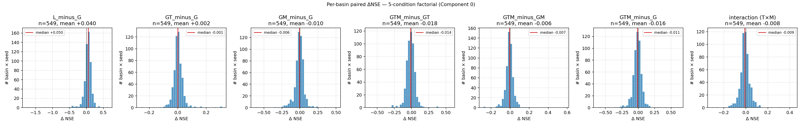
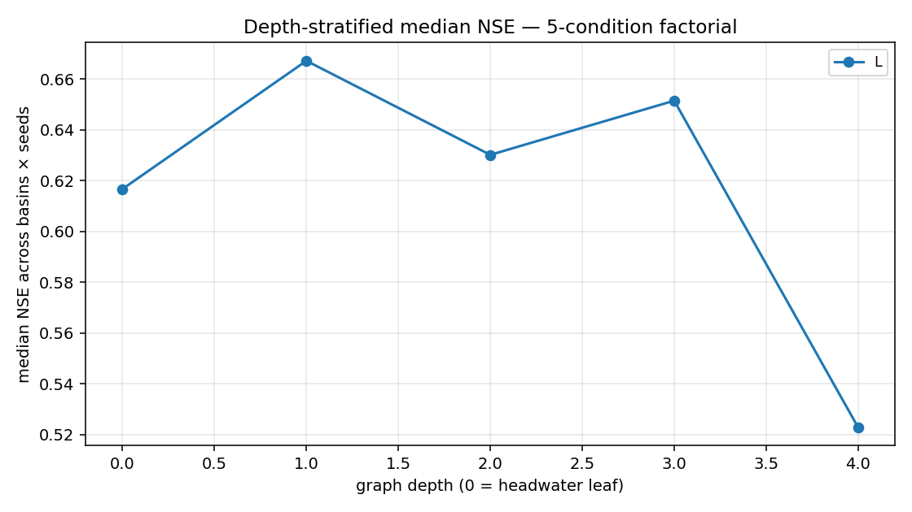
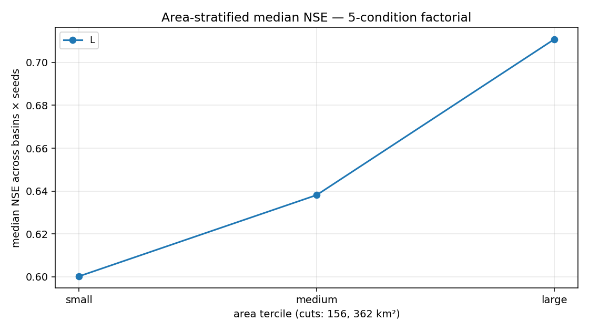

# 5-Condition Factorial — Results (Component 0, 183 basins)

Auto-generated by `experiments/analysis/compare_5conditions.py`. Re-run the script after every fresh sweep.

## Headline — cross-seed median (with bootstrap 95% CI)

| Condition | NSE | KGE | log-NSE | Seeds |
|---|---|---|---|---|
| L | +0.645  [+0.645, +0.645] | +0.721  [+0.721, +0.721] | +0.686  [+0.686, +0.686] | 42 |
| G | — | — | — | (no data) |
| G+T | — | — | — | (no data) |
| G+M | — | — | — | (no data) |
| G+T+M | — | — | — | (no data) |

## Six pairwise contrasts (paired per basin × seed) — NSE

| Contrast | n | median Δ | 95% CI | strongly + | strongly − |
|---|---|---|---|---|---|
| L − G   (architecture / methodology delta) | — | — | — | — | — |
| (G+T) − G   (effect of topology features alone) | — | — | — | — | — |
| (G+M) − G   (effect of message passing alone) | — | — | — | — | — |
| (G+T+M) − (G+T)   (adding messages on top of T) | — | — | — | — | — |
| (G+T+M) − (G+M)   (adding T on top of M) | — | — | — | — | — |
| (G+T+M) − G   (combined effect) | — | — | — | — | — |

## Interaction term  ((G+T+M) − (G+T) − (G+M) + G)

Not enough conditions present yet to compute the interaction.

**Reading guide:**
- Median ≈ 0 → topology features and messages are *additive* (each contributes independently).
- Median > 0 → super-additive (the combination is bigger than the sum of parts; complementary signals).
- Median < 0 → sub-additive (T and M overlap; combining gains less than the parts suggest).

## Outlier-trimmed (drop bottom-5% NSE per seed)

| Condition | full median NSE | trimmed median NSE | shift |
|---|---|---|---|
| L | +0.645 | +0.658 | +0.013 |
| G | — | — | — |
| G+T | — | — | — |
| G+M | — | — | — |
| G+T+M | — | — | — |

## Stratified plots

## Provenance

- Run folder: `runs/5cond_factorial/`
- Conditions found: L (1 seed(s)), G (0 seed(s)), G+T (0 seed(s)), G+M (0 seed(s)), G+T+M (0 seed(s))
- Metrics computed identically from raw test predictions.
- Bootstrap CIs across seeds (paired Δ values for contrasts), n_boot=2000, alpha=0.05.
